# 🎴 Tarot App — Product, UX, and Context Engineering Blueprint

**Author:** Senior SWE & UX Lead (you)
**Date:** 2025-08-10
**Goal:** Ship a world‑class, emotionally intelligent Tarot app that blends craft, psychology, and AI. This is an end‑to‑end blueprint: product vision → UX flows → technical architecture → AI context engineering → metrics.

---

## 1) Product North Star

**Promise:** *“Feel seen in 3 minutes, grow wiser every day.”*
**North‑Star Metric:** 7‑day reflective streaks per user.
**Pillars:**

1. **Meaningful Insight** (accurate, contextual, compassionate)
2. **Emotional Regulation** (affect labeling, reframing, rituals)
3. **Craft & Mystery** (beautiful decks, tactility, ceremony)
4. **Trust & Ethics** (clear boundaries, privacy, no fatalism)

**Primary JTBDs**

* *I feel stuck—help me reflect & decide.*
* *I want a ritual to start/close my day.*
* *I want to learn Tarot & my patterns over time.*

---

## 2) Audience & Behavioral Psychology

**Personas**

* **Seeker Maya (22–34):** Emotions high-variance; wants validation + gentle guidance.
* **Builder Alex (28–45):** Self‑development; wants structured prompts + journaling.
* **Curious Nova (16–24):** Social + play; wants shareable readings and aesthetics.

**Psychology Principles (ethical application)**

* **Affect Labeling**: Help users name feelings to reduce intensity.
* **Cognitive Reappraisal**: Offer alternative framings for agency.
* **Self‑Determination Theory**: Autonomy (opt-in choices), competence (learning path), relatedness (community rituals).
* **Peak‑End Rule**: Design a strong insight moment + soothing closing ritual.
* **Zeigarnik Effect**: “Threads” of open reflection to drive return.
* **Variable Reward (gentle)**: Deck art, micro‑animations, collectible spreads—without manipulative loops.
* **Loss Aversion (soft)**: Preserve streaks with “grace days”, compassionate copy.

---

## 3) Signature Features

1. **Daily Card + Mood Check**

   * Swipe to draw → haptic “click”.
   * Emotion wheel → tag intensity 1–5.
   * Instant micro‑insight + 1 actionable micro‑ritual.

2. **Context‑Aware Readings (AI‑guided)**

   * Spreads: One‑Card, Past‑Present‑Future, Celtic Cross, Decision Matrix.
   * Reading tone adjustable: *soft*, *balanced*, *direct*.
   * Pulls from user profile (goals, values), recent journal, mood, and open threads.

3. **Journaling with Coaching**

   * “Reflect now” prompts, affect labeling, CBT‑style reframes.
   * Timeline + pattern insights (e.g., “Swords appear during deadlines”).

4. **Rituals & Breathwork**

   * 2–4 min guided audio; box breathing; “closing the loop” ritual.
   * Sync with calendar for intention setting.

5. **Learning Path**

   * Bite‑size lessons; spaced repetition flashcards per card/archetype.
   * Deck lore + symbolism viewer.

6. **Community (optional, private by default)**

   * Prompt circles; anonymized share; modded, supportive tone guidelines.

7. **Aesthetic System**

   * Multiple decks (RWS, Thoth‑inspired, Minimalist, Cosmic).
   * Tactile animations, subtle haptics, ambient audio.

8. **AR Tabletop Draw (Phase 2)**

   * Place a virtual velvet cloth; cards anchor in space.

---

## 4) Experience Principles & Tone

* **Voice:** Warm, non‑fatalistic, agency‑affirming, avoids absolutes.
* **Microcopy:** “Here’s one way to see it…” “You still choose your path.”
* **Motion:** Slow easing, no flashing; haptics for card snap + ritual close.
* **Accessibility:** Voiceover labels for every card; high‑contrast theme; dyslexia‑friendly font option; captions for audio.

---

## 5) Golden Path UX Flows (Wireframe‑level)

**Onboarding (T<3 min)**

1. Intent select: *clarity*, *confidence*, *calm*.
2. Boundaries: “We don’t predict the future—this is reflection.”
3. Pick deck style + tone.
4. First draw → emotion tag → micro‑insight → bookmark ritual.

**Daily Loop (D0–D7)**

* *Home → Draw → Insight → Save → Journal → Ritual → Close.*
* End screen: peak moment (insight card + mantra) + streak confetti (soft).

**Reading Session Flow**

* Choose question → choose spread → draw (manual shuffle) → AI interprets with context → 3 lenses: *emotions*, *action*, *lesson* → save to thread.

**Journal Flow**

* Prompt → free write → AI summarizer (opt‑in) → mood delta → tag themes.

---

## 6) Visual Design System

* **Palette:** Deep ink, moonstone, ember, sage. Dark default with light option.
* **Type:** Serif for card titles (ritual), humanist sans for UI.
* **Cards:** 3D parallax tilt, gilt edges, velvet drop shadow, subtle grain.
* **Components:**

  * Card stack, spread grid, insight chip, mantra card, emotion wheel, ritual timer, progress band, thread list.

---

## 7) Monetization (Ethical)

* **Free:** Daily card, basic journal, 1 ritual/day, core spreads.
* **Plus (Monthly/Annual):** Unlimited rituals, advanced spreads, deck shop, pattern insights, lessons, audio packs.
* **One‑off:** Artist decks; gift codes.
* **No paywalls on mental health safety features.**

---

## 8) Safety, Consent, and Boundaries

* Clear disclaimers; crisis resources surfaced if strong distress signals.
* Block lists for topics users want to avoid.
* “Compassion Mode” reduces directiveness when mood ≤2/5.
* Age gate and moderation in community.
* No health/financial deterministic claims.

---

## 9) Technical Architecture (High‑Level)

**Client:** React Native (Expo) or Flutter.
**Backend:** Node/TypeScript (API, realtime), Python (AI orchestration).
**DB:** Postgres (OLTP), Redis (sessions), S3/GCS (media).
**AI:** LLM for readings/coaching; embedding retriever for user memory; on‑device inference (lite) for privacy where possible.
**Vector DB:** pgvector or Pinecone.
**Analytics:** PostHog / Amplitude.
**Auth:** OAuth + passkeys.
**Push:** FCM/APNs.
**Content:** CMS (Sanity/Strapi) for deck text, lessons, rituals.

---

## 10) Data Model (Sketch)

```mermaid
classDiagram
  class User { id uuid; tone enum; deck_id; timezone; consent_flags jsonb }
  class MoodEntry { id; user_id; val 1..5; tags[]; created_at }
  class Journal { id; user_id; text; highlights jsonb; embedding vector; created_at }
  class Draw { id; user_id; spread; cards[]; question; context jsonb; created_at }
  class Insight { id; draw_id; summary; actions[]; mantra; sentiment; created_at }
  class Ritual { id; title; steps[]; duration; audio_url }
  class Thread { id; user_id; title; status; last_event_at }
```



**Key JSON Schemas**

```json
{
  "user_profile": {
    "values": ["growth", "stability"],
    "goals": ["improve boundaries"],
    "avoid_topics": ["breakup details"],
    "tone": "soft",
    "deck": "RWS-Minimal",
    "timezone": "Asia/Jakarta"
  },
  "draw_context": {
    "question": "How to handle a tough conversation at work?",
    "mood": {"val": 2, "labels": ["anxious", "tense"]},
    "recent_signals": ["deadline in 2 days", "slept 5h"],
    "history_refs": ["thread:work-boundaries"],
    "guardrails": ["no legal/medical advice", "non-fatalistic"]
  }
}
```

---

## 11) Context Engineering for AI Readings

**Objectives**

* Personal, grounded, ethical insights with short actionable steps.
* Tight control over tone and boundaries.
* Deterministic structure with room for creativity.

**Context Stack (priority order)**

1. **System Charter** (ethics, role, structure)
2. **Deck Knowledge Pack** (card meanings, reversals, symbolism)
3. **User Snapshot** (values, tone, mood, streak, recent events; 1–2 KB summary)
4. **Query Packet** (question + spread + drawn cards + positions)
5. **Relevant Memories** (top‑k journal lines via embeddings)
6. **Guardrails & Style** (do/don’t list; length; bullet patterns)
7. **Chain‑of‑Thought Hidden** (internal reasoning disabled in outputs)
8. **Output Schema** (JSON for app + human‑readable card)

**System Charter (example)**

```
ROLE: You are a compassionate Tarot guide for reflective growth. You never predict the future or give legal/medical/financial advice. You always affirm user agency.
TONE: Warm, grounded, non-judgmental. Avoid absolutes. Use simple language.
STRUCTURE: For each reading, produce: {summary, emotions, actions[1-3], mantra, learning, disclaimers}. Keep total under 220 words unless long-form mode is enabled.
ETHICS: If user distress is detected, include a gentle resource hint. Respect user avoid_topics. If user asks for determinism or fate, reframe toward choices.
```

**Output Schema**

```json
{
  "summary": "",
  "emotions": ["named feelings"],
  "actions": ["1-3 concrete steps"],
  "mantra": "",
  "learning": "archetypal lesson",
  "safety": {"crisis_hint": false, "notes": ""}
}
```

**Prompt Template (Reading)**

```
[Deck Knowledge Pack]
[User Snapshot]
[Query Packet]
[Guardrails & Style]

Write the reading in the Output Schema JSON ONLY. No preamble.
```

**Query Packet Example**

```json
{
  "spread": "Past-Present-Future",
  "cards": [
    {"name":"Eight of Swords","position":"Past","reversed":false},
    {"name":"Strength","position":"Present","reversed":false},
    {"name":"Two of Wands","position":"Future","reversed":true}
  ],
  "question": "How to handle the tough work conversation?",
  "mood": {"val": 2, "labels":["anxious"]}
}
```

**Memory Strategy**

* Maintain **User Snapshot** as a rolling 1–2 KB summary updated after each session.
* Store full journals as embeddings; retrieve top‑k sentences relevant to the current question and cards.
* Truncation policy: never drop System Charter or Guardrails; compress Deck Knowledge with “card‑specific slice.”

**Retrieval Rules**

* Top‑k=6, diversity‑enhanced (MMR) to avoid redundancy.
* Recency boost (last 21 days) + streak boost.

**Safety Rules**

* Keyword & sentiment detector → if high distress: add resource line + suggest grounding ritual.
* Forbidden: deterministic life predictions, medical/legal/financial specifics.

---

## 12) AI Function Contracts (for Tool‑Use LLMs)

```ts
/** Draw cards from a deck with optional seed for reproducibility */
function draw_cards(args: { spread: string; deck_id: string; seed?: number }): {
  spread: string; cards: { id: string; name: string; reversed: boolean; position: string }[]
}

/** Log journal entry with optional affect labels */
function log_journal(args: { text: string; moods?: string[]; intensity?: 1|2|3|4|5; thread_id?: string }): {
  journal_id: string; highlights: string[]
}

/** Recommend a short ritual given context */
function recommend_ritual(args: { goal: "calm"|"clarity"|"confidence"; time_min: number; mood_val?: number }): {
  ritual_id: string; steps: string[]; breath_cadence?: string
}

/** Persist insight summary to the thread */
function save_insight(args: { draw_id: string; summary: string; actions: string[]; mantra: string }): { insight_id: string }
```

---

## 13) Example Deck Knowledge Slice (RWS)

```json
{
  "Strength": {
    "upright": ["inner resilience", "gentle power", "self-regulation"],
    "reversed": ["self-doubt", "forcefulness", "fatigue"],
    "symbols": ["lion", "infinity", "white dress"],
    "advice": "lead with calm courage; pair firmness with warmth"
  }
}
```

---

## 14) Microcopy Library

* **Draw CTA:** “When you’re ready, shuffle.”
* **Affect Labeling:** “Which words fit right now?”
* **Reframe Nudge:** “Want a different angle?”
* **Close Ritual:** “Seal this with one breath.”
* **Boundary Copy:** “This is reflection, not prediction.”

---

## 15) Sample Outputs (Human Card & JSON)

**Human Card (UI)**

> *You’re stronger than the story of stuckness. Name the fear, then set one boundary today. Small moves count.*

**JSON**

```json
{
  "summary": "Courage through gentle self-control; choose a small boundary now.",
  "emotions": ["anxiety", "anticipation"],
  "actions": ["Write your key need in 1 sentence.", "Pick a time to speak.", "Practice a 4-4-6 breath before the chat."],
  "mantra": "Calm is my strength.",
  "learning": "Strength teaches power with softness.",
  "safety": {"crisis_hint": false, "notes": ""}
}
```

---

## 16) Growth & Retention

* **Activation:** 3‑day “Foundations” quest (learn → daily → journal).
* **Streaks:** Grace days + narrative badges (e.g., “Seeker of Swords”).
* **Re‑engagement:** Push with intention + ritual suggestion, never fear‑based.
* **Referrals:** Gift a reading; deck unlock for both.

---

## 17) Metrics & Experiments

**Core Metrics**: D1/D7 retention, reflective streaks, read→journal conversion, ritual completion, NPS, wellbeing self‑report delta.
**A/B Ideas**: tone presets, ritual length, emotion wheel vs list, reframe button, AR draw vs standard, end‑screen mantra length.

---

## 18) Implementation Roadmap (90 Days)

**Phase 0 (Week 1–2):** Design system, deck slice, system charter, mood tracker, daily draw.
**Phase 1 (Week 3–6):** Context‑aware readings, journaling, insights storage, rituals.
**Phase 2 (Week 7–10):** Learning path, pattern insights, push, paywall.
**Phase 3 (Week 11–13):** Community beta, AR prototype, artist decks.

---

## 19) Example API Shapes

```http
POST /v1/readings
Body: { user_id, spread, question, deck_id }
→ 201 { draw_id, cards }

POST /v1/readings/{draw_id}/interpret
Body: { user_snapshot, query_packet }
→ 200 { summary, emotions, actions, mantra, learning, safety }

POST /v1/journals
Body: { user_id, text, moods, intensity }
→ 201 { journal_id, highlights }
```

---

## 20) Copy & Tone Guardrails (Do/Don’t)

**Do**: validate feelings; emphasize choice; keep it brief; offer 1 small action.
**Don’t**: predict fate; shame; overwhelm with jargon; give specifics on medical/legal/finance.

---

## 21) QA Heuristics

* *Clarity*: ≤220 words, 3 sections max.
* *Compassion*: contains validation + agency.
* *Actionability*: at least 1 step is ≤2 minutes.
* *Safety*: no prohibited claims; resources surfaced when needed.
* *Aesthetics*: card render clear, readable in low light.

---

## 22) Future Ideas

* **Voice readings** with emotion prosody.
* **On‑device mood detection** (opt‑in) from typing cadence.
* **Dream log** integration.
* **Sigil builder** for intentions.
* **Open creator tools** for community decks.

